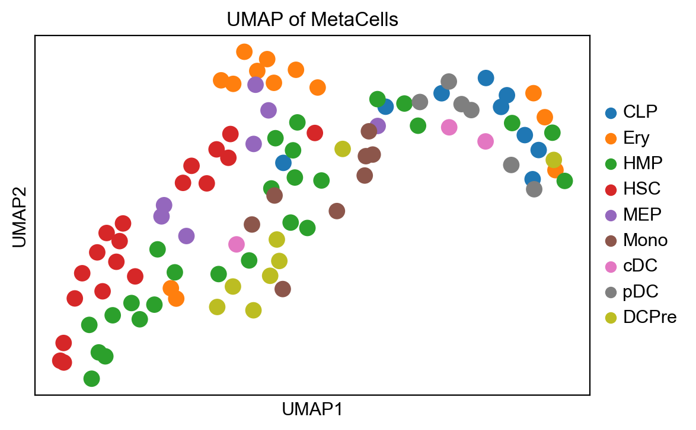
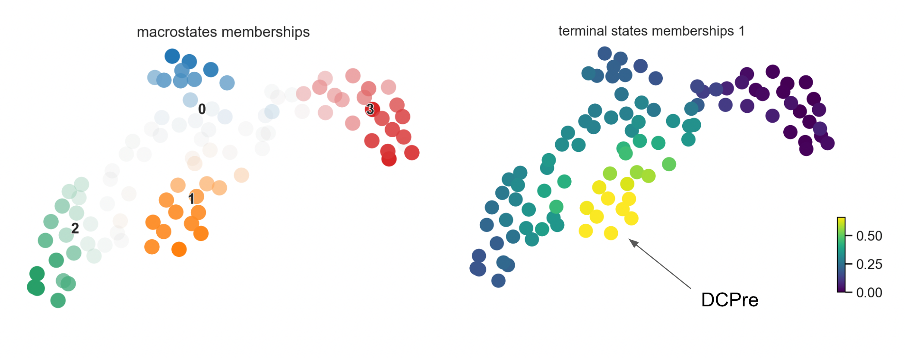

# CellRank with ATAC-seq

In this project, we used ATAC-seq to inform directionality in single-cell trajectory inference by adapting the [CellRank](https://cellrank.org/) algorithm to use gene regulation instead of RNA velocity.


*UMAP of metacell gene expression colored by cell type.*


*Macrostate and terminal state membership computed using CellRank with a combined kernel (gene expression + ATAC-seq).*

### Install dependencies

To run the code, first install the required Python libraries from the environment.yml file.
```
conda env create -f environment.yml
```

### Data
Most of the data to run the code has been included in the `data/` directory:
- `data/rna_meta_ad.p`: gene expression for metacells (output of `SEACell_ATAC_analysis.ipynb`)
- `data/cd34_gene_scores.csv`: gene scores for metacells (output of `SEACell_ATAC_analysis.ipynb`)

To run the `SEACell_ATAC_analysis.ipynb` notebook, download the following large data files separately:

- [cd34_multiome_rna.h5ad](https://dp-lab-data-public.s3.amazonaws.com/SEACells-multiome/cd34_multiome_rna.h5ad)
- [cd34_multiome_atac.h5ad](https://dp-lab-data-public.s3.amazonaws.com/SEACells-multiome/cd34_multiome_atac.h5ad)
- [hg38.gtf](https://dp-lab-data-public.s3.amazonaws.com/SEACells-multiome/hg38.gtf)

### Code
This project contains four key notebooks:
1. `SEACell_ATAC_analysis.ipynb`: This notebook from the [SEACells](https://github.com/dpeerlab/SEACells) repo computes metacells and gene accessibility scores given RNA-seq and ATAC-seq data.
2. `Pseudotime Kernel.ipynb`: Runs CellRank with CytoTRACEKernel (directionality informed by gene expression only, no ATAC-seq).
3. `Cosine Similarity Kernel.ipynb`: Runs CellRank with custom CosineSimilarityKernel (directionality informed by ATAC-seq only, no gene expression).
4. `Combined Kernel.ipynb`: Runs CellRank with combined ConnectivityKernel and CosineSimilarityKernel (directionality informed by both gene expression and ATAC-seq).
